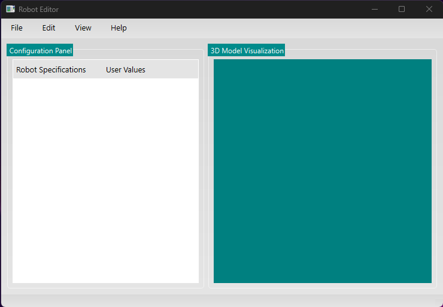
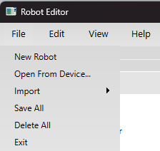
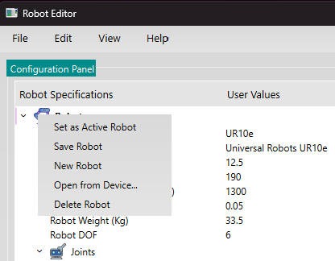
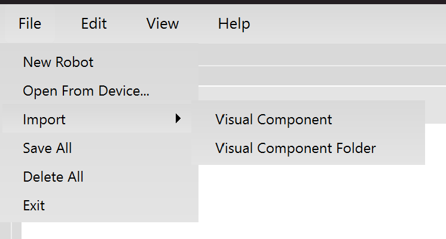
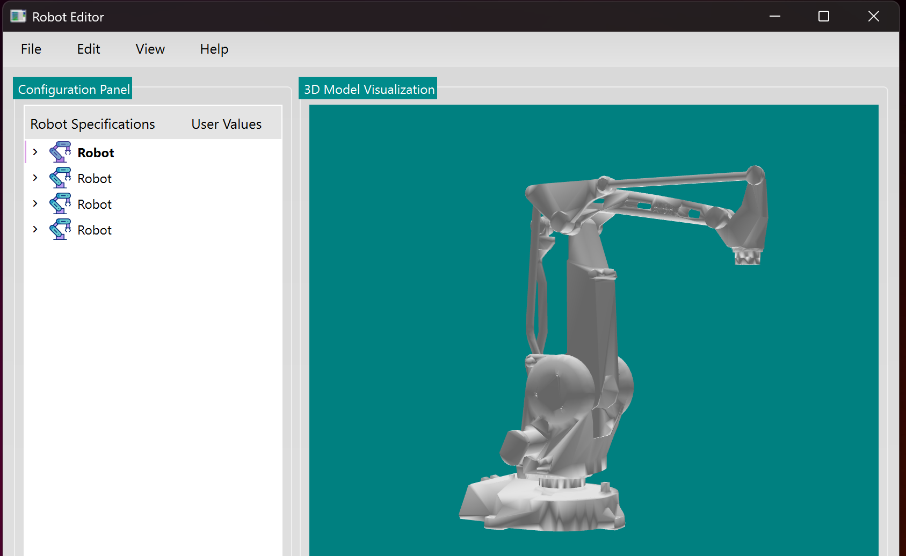
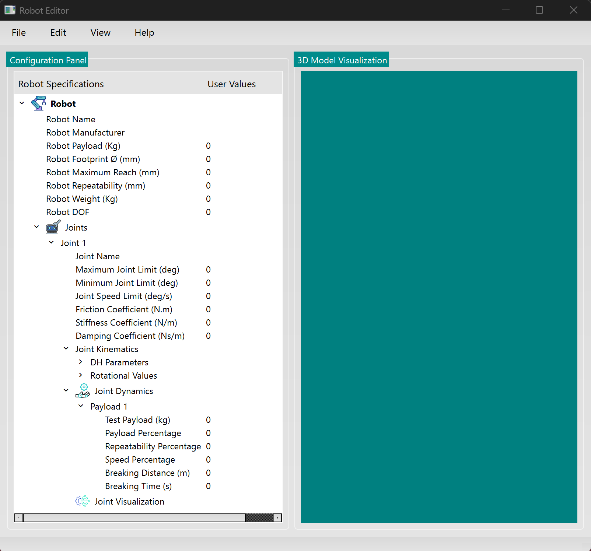
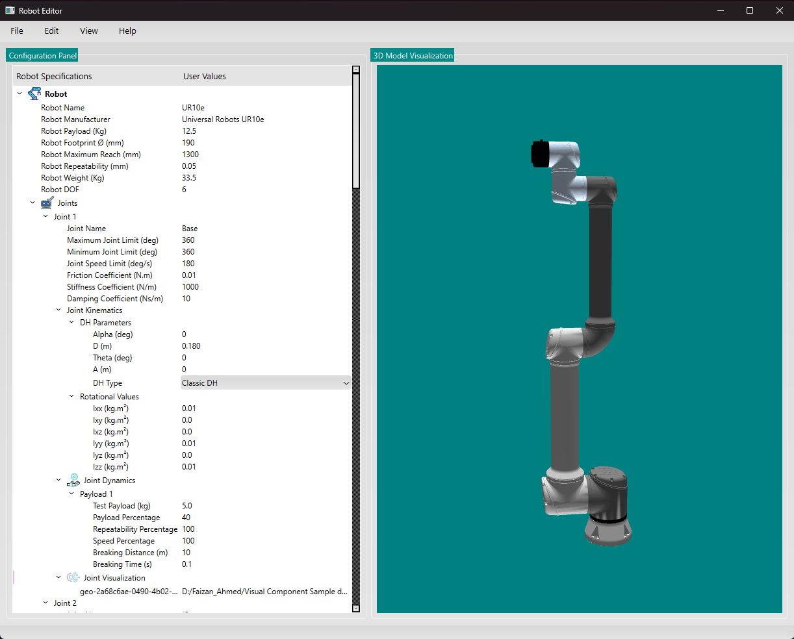
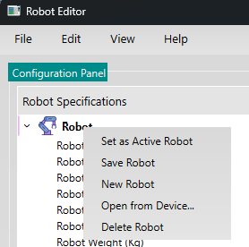
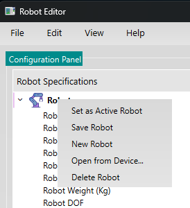
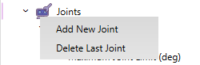

# RobotEditor User Guide

Welcome to the user guide for **RobotEditor**! This guide will help you get started, explain the main features, and walk you through common tasks step-by-step. Screenshots can be added at the indicated locations for visual reference.

---

## Table of Contents

- [Introduction](#introduction)
- [Getting Started](#getting-started)
- [Main Features](#main-features)
- [Step-by-Step Usage](#step-by-step-usage)
    - [Launching the Application](#launching-the-application)
    - [Creating a New Robot](#creating-a-new-robot)
    - [Adding Multiple Robots](#adding-multiple-robots)
    - [Importing Robots](#importing-robots)
    - [Opening Robot Packages](#opening-robot-packages)
    - [Editing Robots and Robot Properties in TreeView](#editing-robots-and-robot-properties-in-treeview)
    - [Visualizing Robots in 3D](#visualizing-robots-in-3d)
    - [Exporting and Saving Robots](#exporting-and-saving-robots)
    - [Deleting Robots, Joints, and Payloads](#deleting-robots-joints-and-payloads)
- [Troubleshooting & FAQ](#troubleshooting--faq)

---

## Introduction

**RobotEditor** is a Qt-based application for creating, editing, visualizing, and managing robot configurations. It supports 3D visualization, joint and dynamics editing, and import/export of robot data in various formats.

---

## Getting Started

1. **Install RobotEditor** on your system.
2. Launch the application from your desktop or terminal.
3. The main window will appear. This is the main window of RobotEditor, which is empty at the start. You will begin working from this point to create and manage your robots.

---

## Main Features

- **Create, Import, Open, Save, and Delete Robots**
- **Open from Device:** You can open existing robot models that you have already created in RobotEditor.
- **Import:** Import VCMX files from Visual Components directly, or import a folder containing a Visual Component robot model.
- **Export:** Export robot data as a zip folder in `.re` format for easy sharing and backup.
- **3D Visualization** of robot models and joints
- **Add Visualization:** Add multiple OBJ files for a single joint to enhance 3D representation.
- **Add Multiple Joints:** You can add multiple joints to a robot for complex configurations.
- **Add Multiple Robots:** Manage and work with multiple robots at the same time in the application.
- **Edit Robot and Joint Properties** via a tree view
- **Support for Joint Dynamics and Kinematics Editing**
- **Context Menu Actions** for adding/removing joints and payloads
- **JSON Serialization/Deserialization** for robot data

---

## Step-by-Step Usage

### Launching the Application

- Double-click the RobotEditor icon or run it from the terminal.
- The main window will appear, showing a window with a top menu that has options for navigation. The main part is divided into two sections: the left part is the data area where the tree structure of the robot is presented, and the right side displays the 3D model of the robot when loaded.

### Creating a New Robot

1. Click on the **File** menu at the top of the window.
2. Select **"New Robot"** from the dropdown menu.
3. A new robot will be added to the tree view and you can start editing its properties.

### Adding Multiple Robots

- Repeat the steps above to add more robots.
- Each robot will appear as a separate item in the tree view.
- Alternatively, you can also right-click on an existing robot in the tree view and select **"New Robot"** from the context menu to add another robot.

### Opening Robot Packages

You can open existing robot packages using either of the following methods:

**Method 1: Using the File Menu**
1. Click on the **File** menu at the top of the window.
2. Select **"Open from Device..."** from the dropdown menu.
3. Choose a `.re` package file.
4. The robot data and 3D model will be loaded.

**Method 2: Using the Tree View**
1. Right-click in the tree view area.
2. Select **"Open from Device..."** from the context menu.
3. Choose a `.re` package file.
4. The robot data and 3D model will be loaded.

### Importing Robots

#### From VCMX File
1. Click on the **File** menu at the top of the window.
2. Select **"Import"** from the dropdown menu.
3. Select **"Visual Component"**.
4. Choose a `.vcmx` file from your device.
5. The robot will be imported and displayed.

#### From VCMX Folder
1. Click on the **File** menu at the top of the window.
2. Select **"Import"** from the dropdown menu.
3. Select **"Visual Component folder"**.
3. Choose a folder containing VCMX data.
4. The robot will be imported and displayed.

Similarly, from the **File** menu, you can:
- Save all robots by selecting the **"Save All Robots"** option.
- Delete all robots by selecting the **"Delete All Robots"** option.
- Exit the application by choosing the **"Exit"** option.

### Working with multiple Robots in TreeView

You can add multiple robots to the tree view, allowing you to manage several robot configurations within the same workspace. At any time, one robot is marked as the active robot. To set a robot as active, simply right-click on the robot in the tree view and select **"Set as Active Robot"**. The active robot becomes your primary robot: its properties are expanded in the tree view for easy editing, and its 3D model is displayed in the 3D viewer on the right.

When you mark a different robot as active, the newly selected robot will appear in bold in the tree view, and its 3D model will replace the previous one in the viewer. This makes it easy to switch between and compare the models and properties of different robots, ensuring you can efficiently manage and edit multiple robots in your project.

### Editing Robots and Robot Properties in TreeView

- Click on a robot in the tree view to expand its properties. You can edit details such as robot name, manufacturer, payload, and other specifications directly in the tree view.
- Expand the **Joints** section to view and edit each joint's properties. For every joint, you can modify parameters like joint name, motion range, speed limit, friction, stiffness, and damping coefficients.
- Under each joint, you will find the **Joint Dynamics** section. Here, you can add or delete dynamics payloads, which represent different physical or operational scenarios for the joint (such as payload weight, speed percentage, repeatability, and breaking distance/time). This allows you to simulate and configure how each joint behaves under various conditions.
- The **Visualization** section under each joint lets you add multiple OBJ files to visually represent the joint in the 3D viewer. You can right-click on Visualization and select **"Select OBJ File"** to load a mesh. This is useful for customizing the appearance of each joint and seeing the changes reflected in the 3D model.
- You can right-click on **Joints** to add or delete joints, and right-click on **Joint Dynamics** to add or delete payloads, making it easy to build and modify complex robot structures.

### Visualizing Robots in 3D

- Select a robot to make it active (right-click > "Set as Active Robot").
- The 3D model will appear in the visualization area.
- Use the **Reset Model** and **Rotate Model** actions to adjust the view.
- To visualize a joint, right-click on **Visualization** and select **"Select OBJ File"** to load a 3D mesh.

### Exporting and Saving Robots

- To save a robot, right-click on it and select **"Save Robot"**.
- To save all robots, use the **"Save All Robots"** action.
- Robots are saved as `.re` package files, which include all data and 3D models.

### Deleting Robots, Joints, and Payloads

- To delete a robot, right-click on it and select **"Delete Robot"**.
- To delete all robots, use the **"Delete All Robots"** action.
- To delete a joint or payload, right-click on the respective item and select the delete option.

---

## Troubleshooting & FAQ

### Common Issues

- **No 3D Model Appears:** Ensure you have loaded OBJ files for visualization.
- **Cannot Save Robot:** Check that all required properties are filled in.
- **Import Fails:** Verify the VCMX file/folder is valid and accessible.

### FAQ

**Q: Can I edit joint kinematics and dynamics?**
A: Yes, expand the joint in the tree view and edit the properties as needed.

**Q: How do I export my robot data?**
A: Use the "Save Robot" or "Save All Robots" actions to export as `.re` packages.

**Q: Can I visualize custom meshes?**
A: Yes, use the "Select OBJ File" option under Visualization for each joint.

---

## More Help

For advanced usage, refer to the Doxygen documentation or contact support.

---

